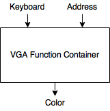

# Container Switcher

## Overview
The Container Switcher is design to select which signal output should be used.

This module works like the Docker. Each function will be packed as a container. Each module will process its own data and provides the color of the display according to the address provided by the switcher and inputs provdied by the keypad.

The container will get inputs from the keyboard processor, and process the instructions from the keyboard. The container switcher will continously asking for the color at a specific position on the display. The position will be described as address.

## Position and Address
There are two kinds of address used in the framework. One is the real address, or called display address. This address is used to describe the pixel on the display screen. It is a 22-bit width unsigned integer. The left 11 bits are for the horizontal position (x position), and the right 11 bits are for the vertical position (y position). This allows us to describe maximum 4095x4095 resolution pixels on the display.

The other one is the pixel address. It is used to describe the pixel on the image. It is an 8-bit width unsigned integer. The left 4 bits are for the x position and the right 4 bits are for y position. This allows us to describe maximum 16x16 resolution image.

## Switcher

A switcher keypad will be directly connect to container manager to swithch the function. This is the realization for function 4.