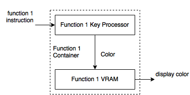

# Function 1 Framework

## Overview

The function 1 is pretty simple. It has a specific keypad processor, which is also the GPU of the function 1. It will translate the switches to the image color data. It will directly write the color data to the video RAM. The video RAM will directly output the current color to the VGA color output.

## Framework

[Back to Home](Home.md)