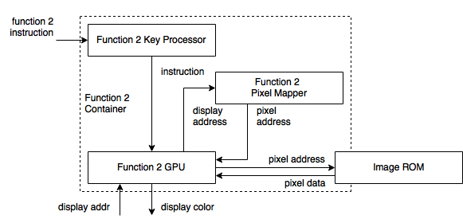

# Function 2 Framework

## Overview

The function 2 has its own keypad processor, GPU. It will use an port of the graphics ROM.

## Framework

## Component Chips
The total container is contructed by three chips: key processor, GPU and the pixel mapper. The major chips of the function 2 is the key processor and its GPU.

### Key Processor
The key processor will simply translate the key information from the keyboard processor to the function 2 specific instruction. The instruction could be identified by the function 2 GPU.

### Pixel Mapper
This is a general module for function 2 and 3. It will check the position of the request display position and return the position on the image.

In other words, this chips decide the way to scale the image. The way to map the display pixel to the image pixel will finally performed as the way to scale the image.

### GPU
This is the main part of the whole container. The missions of the GPU is the following:

1. Identify the instruction.
2. Change the transform parameter according to the instruction.
3. Output the transformed pixel data.

The mission of the GPU could be divided into two parts: save the transform parameter and execute the transform.

To identify the instruction, it could use the `case` statement to do this. If it match one instruction, it could simply change the parameter according to the instruction definition.

To execute the transformation, it will first get the pixel data from the image ROM, and then transform the data one by one.

The transformation in the request is being done via:

* Image Switch: change the current index value of the ROM image index request.
* Rotation: change the pixel position according to the math transform.
* Negative: use the `~` to do the negative.
* Animation: change the display index.

All the realization could be found at the `f2_gpu.v` file.

### Image ROM
It simply save the image and return the pixel data at specific position.

[Back to Home](Home.md)