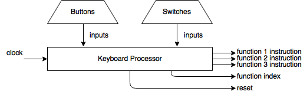

# Keyboard Processor

## Overview
It will process all the keys and switches input into instructions of the function which the function GPU will be processed.

All the key signals will be processed after debouncing. The switch signals will be passed right through.

## Framework

[Back to Home](Home.md)